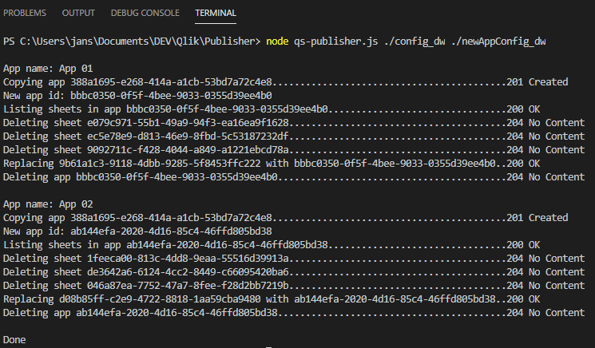

# qs-publisher

Creates multiple apps from templates and replaces already published apps based on provided config.

## Use case

You have one app that you use to develop multiple functionalities but before you publish it to production you have to remove some sheets. Example:

* Dev app with all sheets 1-9
    * App 1 with sheets 1-4 published to stream 1
    * App 2 with sheets 3-5 published to stream 2
    * App 3 with sheets 7-9 published to stream 3

This script helps to do that automatically.

## How does it work?

1. You specify server connection config and new applications' config
2. Run the script with command line
3. For each specified app, the script:
    1. Copies source app
    2. Deletes sheets that are not specified in config file
    3. Replaces specified app (usually already published app) with newly created one
    4. Deletes newly created app (no longer needed)

## Installation and usage

1. [node.js](https://nodejs.org/) is required to run qs-publisher
2. Clone or download repository
3. Using command line navigate to repository folder and run command: npm install 
4. Export certificates from Qlik Sense server in PEM format without password and store them on the same machine that you are running qs-publisher
5. Configure server connection configuration file, use config.js as template, specify path to folder with certificates using forward slashes "/"
6. Configure new apps configuration file, use newAppConfig.js as template 
7. Using command line navigate to repository folder and run command: node qs-publisher.js ./path_to_config/config_file_name ./path_to_newAppConfig/newAppConfig_file_name
    * Example using default files: node qs-publisher.js ./config ./newAppConfig
    * Use forward slashes "/" in path to files 

## Additional information

Use at your own risk as specifying wrong app ids may result in app and data loss!

## License

[MIT](https://choosealicense.com/licenses/mit/)